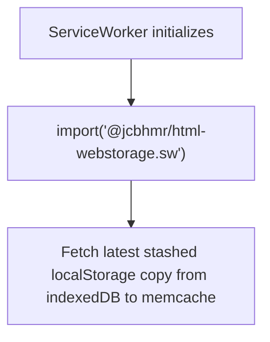
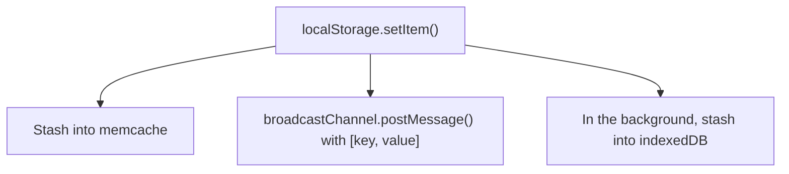
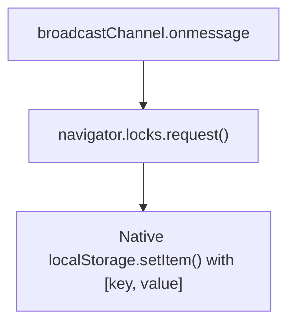

## How it works

For localStorage in a service worker, we can't fetch the initial state of localStorage because there's no Window instances that we can request it from. It's the initial page load, after all!
Instead, we use indexedDB as a persistent "cache" that both windows and the service worker can read/write from/to. This means that this is essentially a glorified indexedDB wrapper. But, we also use a BroadcastChannel to let any client Window instances know that we have updated indexedDB so that they can pull from indexedDB to the localStorage. We then use navigator.locks.request() to run the updating code in a per-origin lock so that it only happens once (not N times, one for each tab)
We also listen to update events in the service worker too so that we asynchronously listen for indexedDB updates to update localStorage in the service worker.
In essence, indexedDB is the data storage backend and a pseudo-perma-message store, while BroadcastChannel is what fires events to keep live updates reflected across window->serviceworker

