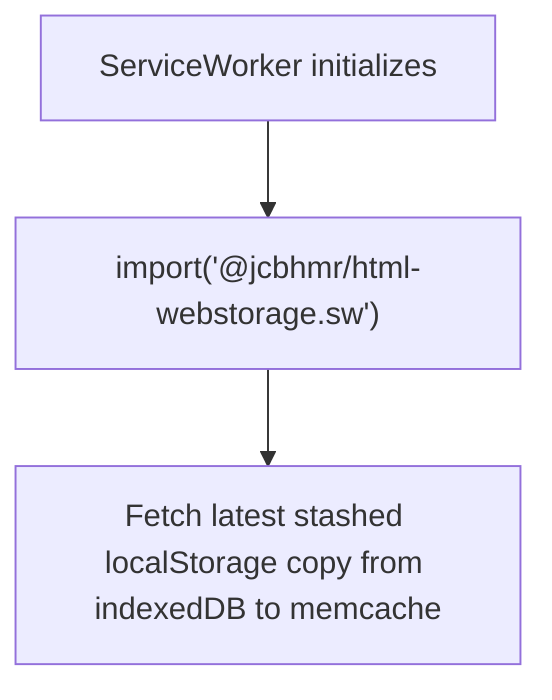
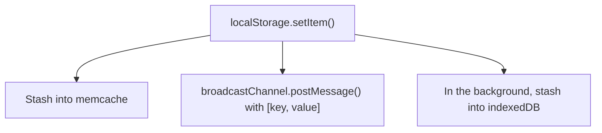
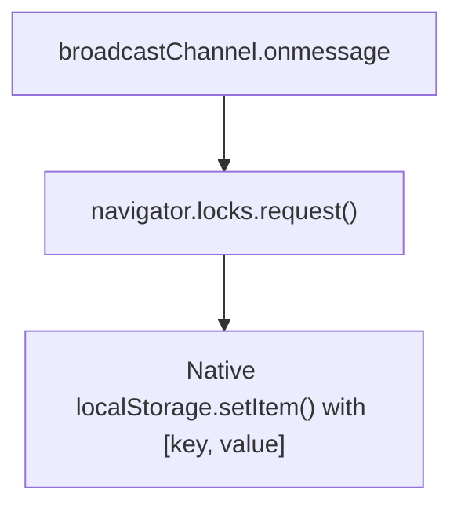

## How it works

For localStorage in a service worker, we can't fetch the initial state of localStorage because there's no Window instances that we can request it from. It's the initial page load, after all!
Instead, we use indexedDB as a persistent "cache" that both windows and the service worker can read/write from/to. This means that this is essentially a glorified indexedDB wrapper. But, we also use a BroadcastChannel to let any client Window instances know that we have updated indexedDB so that they can pull from indexedDB to the localStorage. We then use navigator.locks.request() to run the updating code in a per-origin lock so that it only happens once (not N times, one for each tab)
We also listen to update events in the service worker too so that we asynchronously listen for indexedDB updates to update localStorage in the service worker.
In essence, indexedDB is the data storage backend and a pseudo-perma-message store, while BroadcastChannel is what fires events to keep live updates reflected across window->serviceworker







---

_This isn't intended to be used on its own. See the [main project]._

## How it works

This service worker implementation uses a similar principal to the regular
`Worker` implementation, where we `.postMessage()` to a `Window` with access to
the native `Storage` APIs accessible with the data to update it. But we can't
_quite_ do that because there would be no way to import the state of a `Storage`
object like `localStorage` when first loaded. For instance, take this code:

```js
// sw.js
import "@jcbhmr/html-webstorage.sw";

globalThis.addEventListener("install", () => {
  console.log("Installing!")
})

if (JSON.parse(localStorage.getItem("overrideEverything"))) {
  globalThis.addEventListener("fetch", (event) => {
    event.respondWith(new Response("You've been overridden!"))
  })
}
```

How could we pre-populate the `localStorage` global from an existing `Window`?
We can't! Because there might not be a `WindowClient` that can respond with
`localStorage`'s contents!

Instead, we use `indexedDB` as a fallback messaging channel for when a `Window`
does not exist. We can read the initial state from `indexedDB` when there's no
`WindowClient` objects to use, and once there _is_ a `WindowClient`, that client
can then respond on the `BroadcastChannel` that we use internally for signalling
`Storage` updates from non-`Window` contexts.

The gist is the same though:

1. When the module is first loaded,
2. We maintain an in-memory cache of the current localStorage state

[main project]: https://github.com/jcbhmr/html-webstorage#readme
